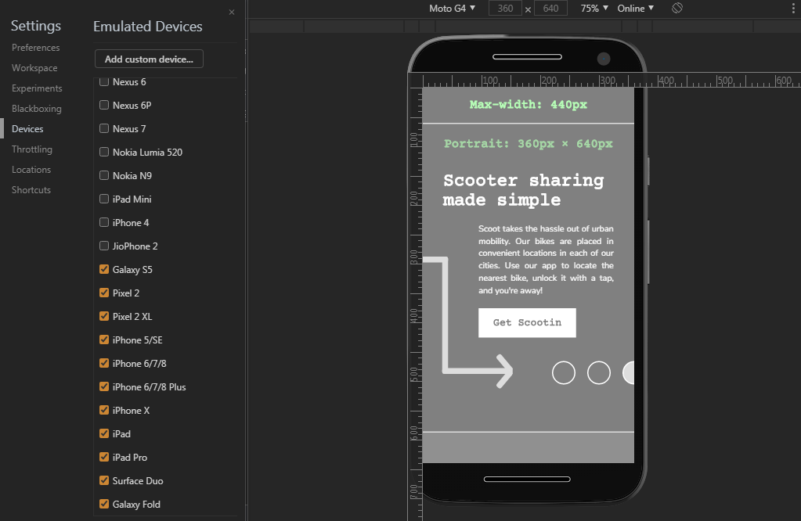
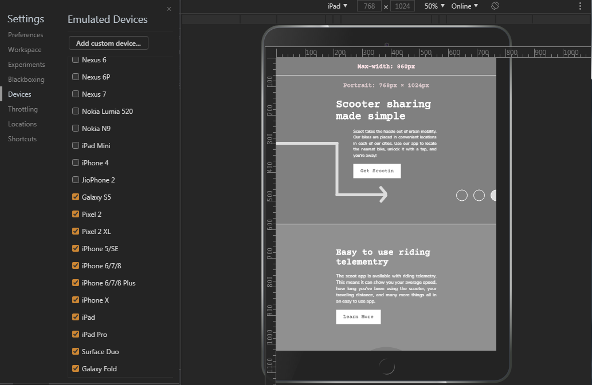
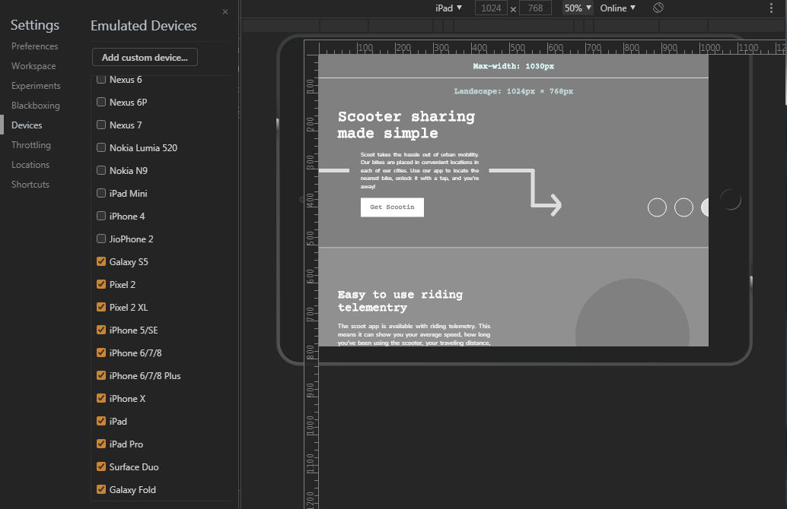
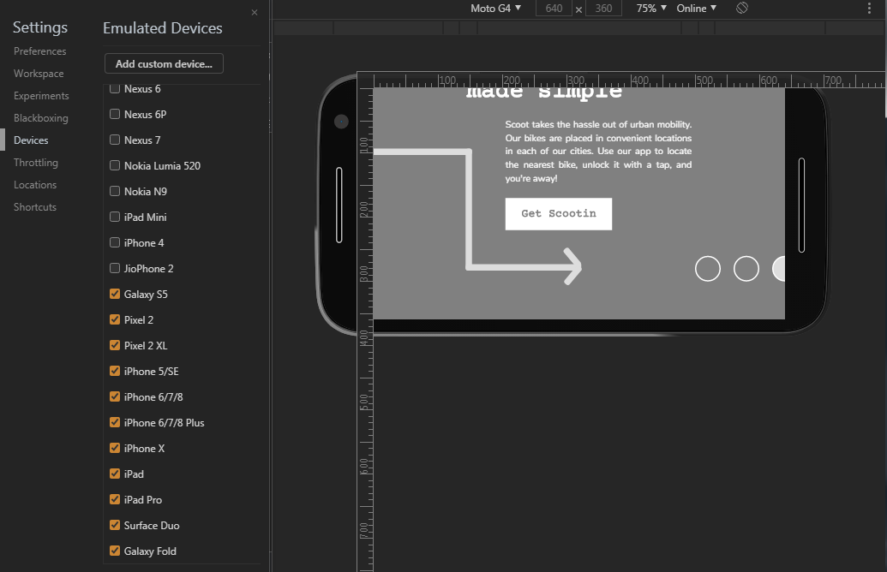
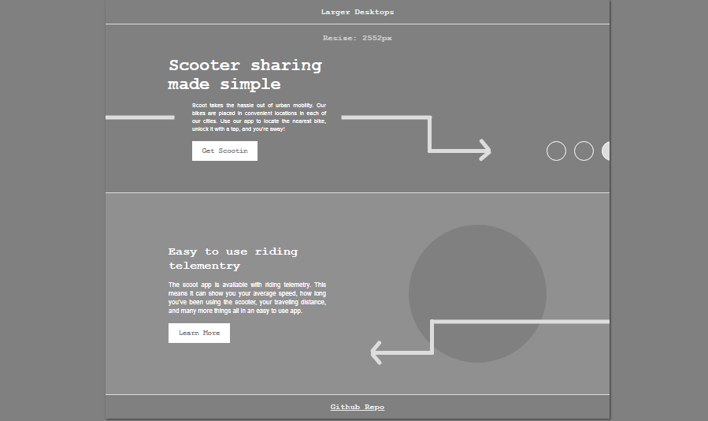
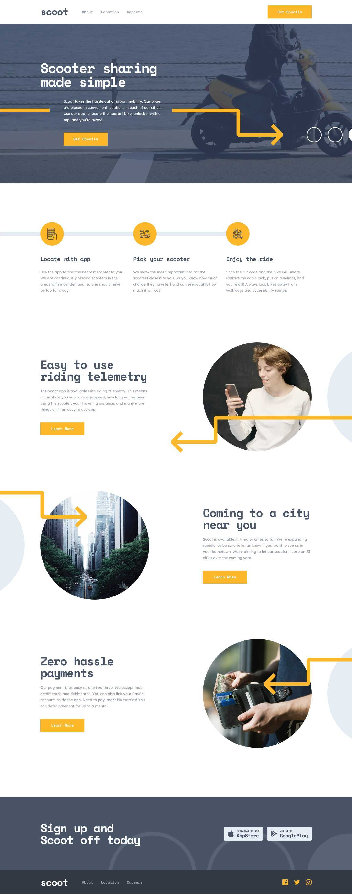

## Scooter Page Prototype
Task given by GADS2020 mentor [Tolufolorunsho](https://twitter.com/Developer_Tolu) in Google Africa Developer scholarship 2020 program. Repo created for reference purpose and is sample for anyone (in GADS2020 mobile specialist track) finding making the arrows responsive hard. Not design oriented. Did not include any distractions like photos, colorful design e.t.c, so that it's easier to see the arrows code. View live on [Github Pages](https://ifycode.github.io/Scooter-page-prototype/).

### My sample - Devices & Orientation

### Original design
